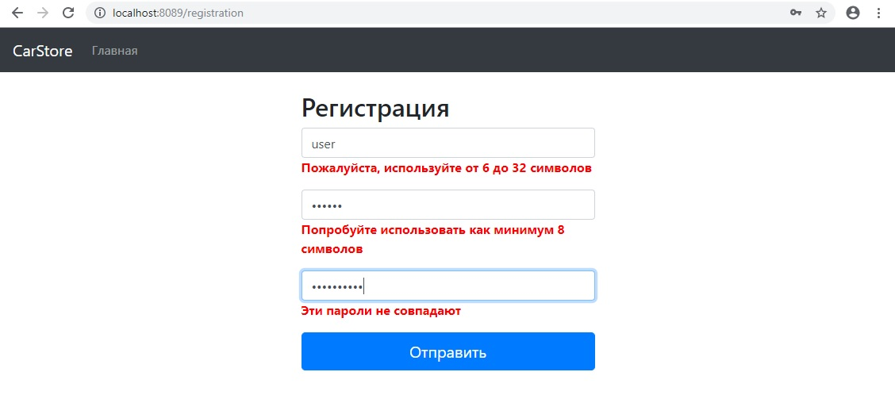
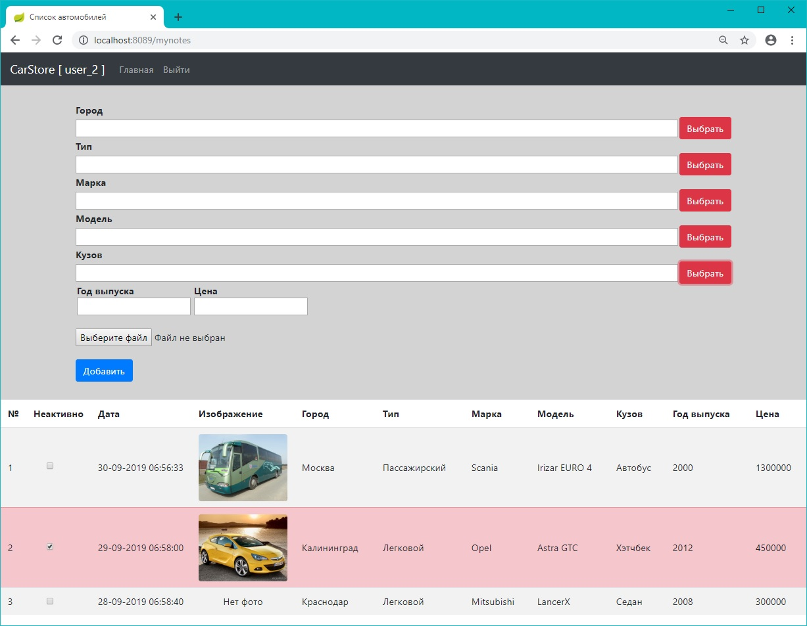
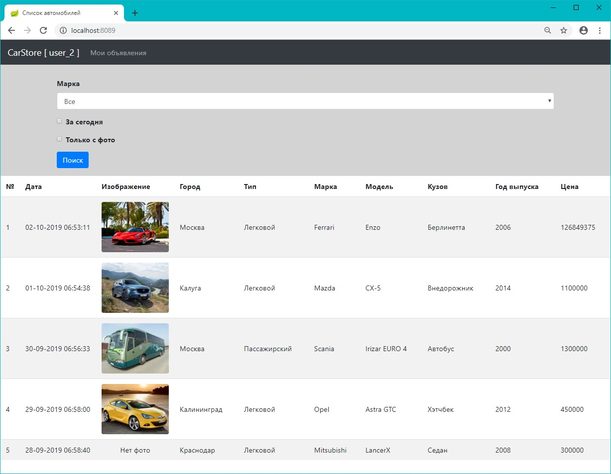
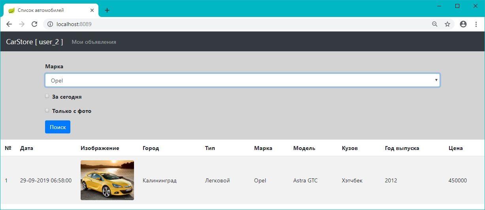

# Репозиторий наиболее интересных проектов, реализованных во время обучения на курсе job4j

<h2>1. Парсер вакансий на sql.ru (Quartz, Jsoup, JDBC, PostgreSQL, Многопоточность)</h2>
Постановка задачи:
 1. Реализовать модуль сборки анализа данных с sql.ru.
 2. Система должна использовать Jsoup для парсинга страниц.
 3. Система должна запускаться раз в день.
 4. Система должна собирать данные только про вакансии Java.
 5. Данные должны храниться в базе данных. 
 6. Учесть дубликаты. Вакансии с одинаковым именем считаются дубликатами.
 7. Учитывать время последнего запуска. если это первый запуск. то нужно собрать все объявления с начало года.
 8. В системе не должно быть ввода-вывода информации, все настройки берутся из файла app.properties.   
   
 <a href="https://github.com/brakhin/portfolio/blob/master/2_sql/src/main/java/ru/bgbrakhi/sql/jobparser/SqlRuParser.java">Основной модуль</a>
 <a href="https://github.com/brakhin/portfolio/tree/master/2_sql/src/main/java/ru/bgbrakhi/sql/jobparser">Ссылка</a> 
<h3>Скриншот</h3>

<h2>2. Сервис покупки билетов в кинотеатр (PostgreSQL, JDBC, JavaServlet, ApacheTomcat, JavaScript, Ajax, BootStrap)</h2>
Постановка задачи:
 Разработать простой веб сайт по покупки билетов в кинотеатр.
 <a href="https://github.com/brakhin/portfolio/tree/master/3_servlets_cinema">Ссылка</a> 
<h3>Выбор места</h3>

<h3>Покупка билета</h3>

<h3>Отображение выбранного места как купленного</h3>

<h2>3. Приложение "список дел" (PostgreSQL, Hibernate, JavaServlet, ApacheTomcat, JavaScript, Ajax, BootStrap)</h2>
Постановка задачи:
Cоздать простое приложение todolist.
 1. веб-приложение должно иметь одну страницу index.html. 
 2. все данные на форму загружаються через ajax.
 3. данные должны сохраняться через hibernate.
 <a href="https://github.com/brakhin/portfolio/tree/master/3_hibernate">Ссылка</a> 
<h3>Общий вид</h3>

<h3>Фильтрация активных записей</h3>

 
<h2>4. Приложение "площадка продажи машин" (PostgreSQL, Hibernate, JavaServlet, ApacheTomcat, JavaScript, Ajax, BootStrap)</h2>
Постановка задачи:
Cоздать приложение удовлетворющее свойствам :
 1. Основная страница содержит все объявления о продаже машин. 
 2. При авторизации пользователя он заходит в свой личный кабинет, где может добавлять машины для продажи
 3. В форме добавления объявления при изменении полей так же меняются списки выбора зависимых от них полей
 4. Если в форме добавления объявления значения нет в выпадающем списке, вводится новое значение.
 5. Только пользователь, создавший объявление, мжет активировать (деактивировать) его.
 6. Используется Hibernate Mapping.
 <a href="https://github.com/brakhin/portfolio/tree/master/3_hibernate_carseller">Ссылка</a> 
<h3>Общий вид</h3>

<h3>Поиск</h3>

<h3>Авторизация(регистрация) пользователя</h3>

<h3>Личный кабинет пользователя</h3>

 
<h2>5. Приложение "площадка продажи машин" (SPRING) (Spring MVC, Spring Data, Spring Security, Spring Boot, Hibernate, PostgreSQL, Ajax, BootStrap, Thymeleaf)</h2>
Постановка задачи:
Cоздать приложение удовлетворющее свойствам :
 1. Основная страница содержит все объявления о продаже машин. 
 2. При авторизации пользователя он заходит в свой личный кабинет, где может добавлять машины для продажи
 3. В форме добавления объявления при изменении полей так же меняются списки выбора зависимых от них полей
 4. Если в форме добавления объявления значения нет в выпадающем списке, вводится новое значение.
 5. Только пользователь, создавший объявление, мжет активировать (деактивировать) его.
 6. Используется Spring.
 7. Добавлена форма регистрации пользователей с валидацией ввода на стороне сервера.
 8. Реализована локализация текста ошибок валидации формы регистрации.
 <a href="https://github.com/brakhin/portfolio/tree/master/3_spring_boot">Ссылка</a> 
<h3>Регистрация пользователя</h3>

<h3>Личный кабинет пользователя</h3>

<h3>Авторизация пользователя</h3>

<h3>Общий вид</h3>

<h3>Поиск</h3>

<h2>Пример реaлизации RESTful приложения с использованием микросервисной архитектуры и SpringSecurity</h2>

1. Пользователь отправляет заявку по оказанию услуги в Ведомство. Заявка содержит паспортые данные пользователя, приложенные документы
2. Специалист Ведомства видит список пришедших заявок, может искать и сортировать по дате, имени заявителя, названю услуги, статусу заявки, видит детализацию по выбранной заявке, может исполнить заявку, терминировав ее

Назначение каталогов Проекта : 

- <b>MvdService</b> - сервис проверки корректности паспортных данных 

- <b>DepService</b> - сервис проверки корректности услуги

- <b>Receiver</b> - сервис приема заявок от пользователей. Использует MvdService и DepService как микросервисы для проверки корректности данных. Корректные данные записываются в БД 
  Подкаталог <b>test_json_data</b> содержит демонстрации данные для отправки JSON-запросов 
  Подкаталог <b>attached_docs содержит</b> полученные изображения приложенных документов.

- <b>Workplace</b> - сервис реализации рабочего места на стороне Министерства для работы с заявками, сохраненными в БД. Использует авторизацию SpringSecurity на основе JWT (JSON Web Token)

 <a href="https://github.com/brakhin/portfolio/tree/master/rest_app">Ссылка</a> 

