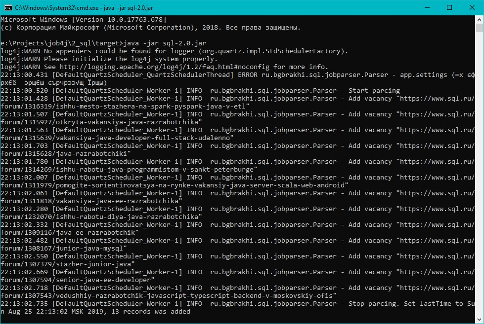
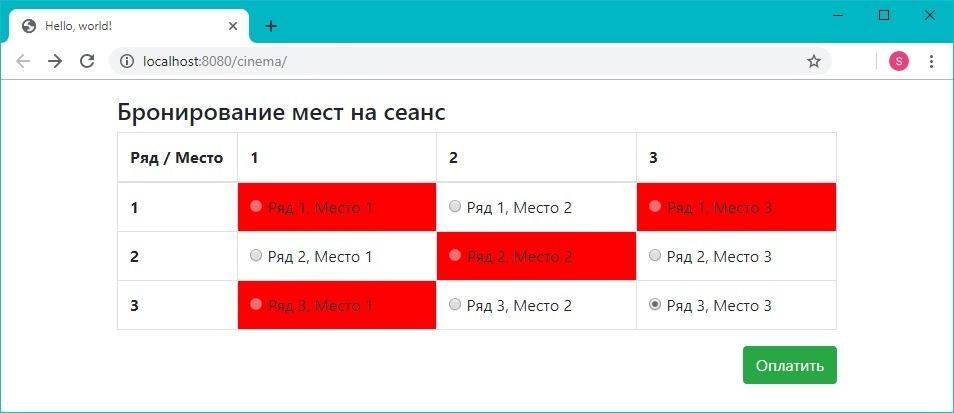
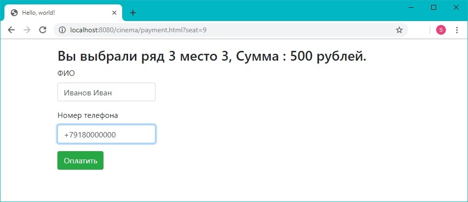
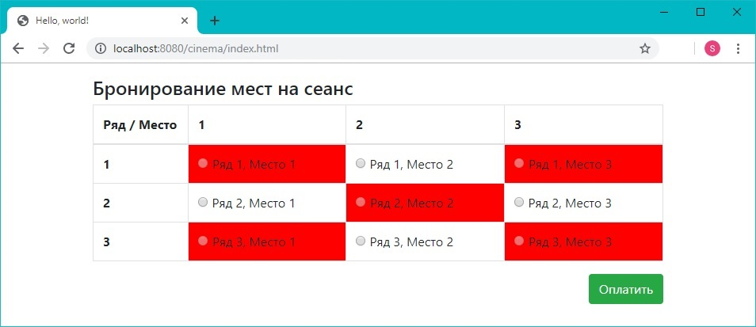
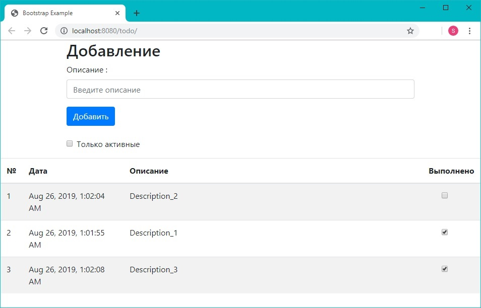
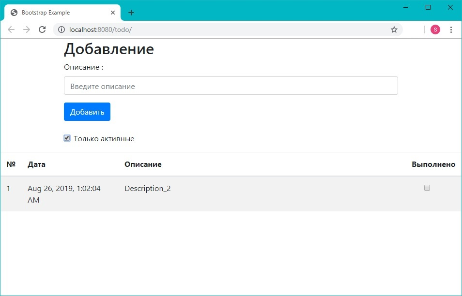
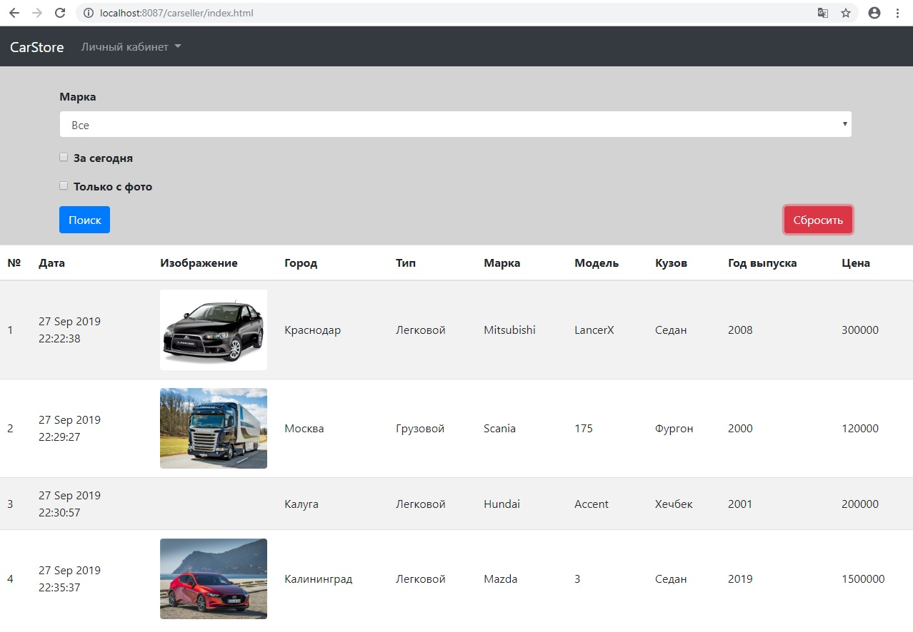
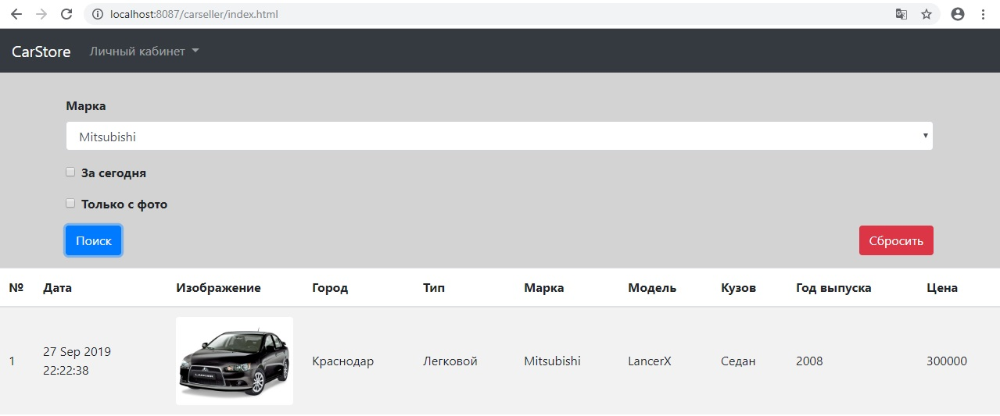
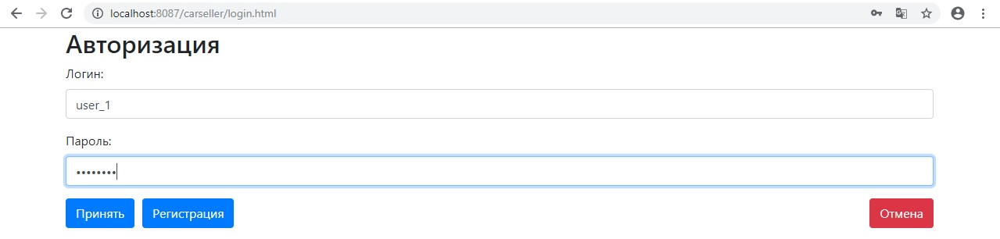
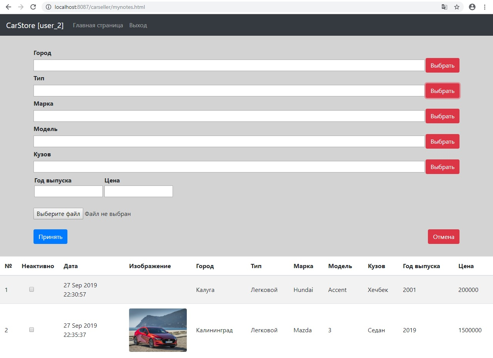

# Репозиторий Бориса Брахина по практическим занятиям курса Job4j  
Ниже приведены наиболее интересные проекты, которые я реализовал во время обучения на курсе Job4j

<b>1. Парсер вакансий на sql.ru (Multithreading, Quartz, Jsoup, JDBC, PostgreSQL)</b>
 Постановка задачи:
 1. Реализовать модуль сборки анализа данных с sql.ru.
 2. Система должна использовать Jsoup для парсинга страниц.
 3. Система должна запускаться раз в день.
 4. Система должна собирать данные только про вакансии Java.
 5. Данные должны храниться в базе данных. 
 6. Учесть дубликаты. Вакансии с одинаковым именем считаются дубликатами.
 7. Учитывать время последнего запуска. если это первый запуск. то нужно собрать все объявления с начало года.
 8. В системе не должно быть ввода-вывода информации, все настройки берутся из файла app.properties.   
   
 <a href="https://github.com/brakhin/job4j/blob/master/2_sql/src/main/java/ru/bgbrakhi/sql/jobparser/SqlRuParser.java">Основной модуль</a>
 <a href="https://github.com/brakhin/job4j/tree/master/2_sql/src/main/java/ru/bgbrakhi/sql/jobparser">Ссылка</a> 
  Скриншот
 

<b>2. Сервис покупки билетов в кинотеатр (PostgreSQL, JDBC, JavaServlet, ApacheTomcat, JavaScript, Ajax, BootStrap)</b>
 Постановка задачи:
 Разработать простой веб сайт по покупки билетов в кинотеатр.
 <a href="https://github.com/brakhin/job4j/tree/master/3_servlets_cinema">Ссылка</a> 
  Выбор места
 
  Покупка билета
 
 Отображение выбранного места как купленного
 

<b>3. Приложение "список дел" (PostgreSQL, Hibernate, JavaServlet, ApacheTomcat, JavaScript, Ajax, BootStrap)</b>
 Постановка задачи:
Cоздать простое приложение todolist.
1. веб-приложение должно иметь одну страницу index.html. 
2. все данные на форму загружаються через ajax.
3. данные должны сохраняться через hibernate.
 <a href="https://github.com/brakhin/job4j/tree/master/3_hibernate">Ссылка</a> 
  Общий вид :
 
  Фильтрация активных записей :
 
 
<b>4. Приложение "площадка продажи машин" (PostgreSQL, Hibernate, JavaServlet, ApacheTomcat, JavaScript, Ajax, BootStrap)</b>
 Постановка задачи:
Cоздать приложение удовлетворющее свойствам :
1. Основная страница содержит все объявления о продаже машин. 
2. При авторизации пользователя он заходит в свой личный кабинет, где может добавлять машины для продажи
3. В форме добавления объявления при изменении полей так же меняются списки выбора зависимых от них полей
4. Если в форме добавления объявления значения нет в выпадающем списке, вводится новое значение.
5. Только пользователь, создавший объявление, мжет активировать (деактивировать) его.
6. Используется Hibernate Mapping.
 <a href="https://github.com/brakhin/job4j/tree/master/3_hibernate_carseller">Ссылка</a> 
  Общий вид :
 
  Поиск :
 
  Авторизация(регистрация) пользователя :
 
  Личный кабинет пользователя :
 
 
