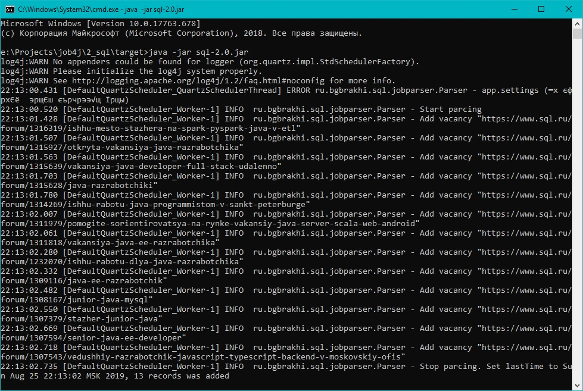

# Парсер вакансий на sql.ru (Quartz, Jsoup, JDBC, PostgreSQL, Многопоточность)

Постановка задачи:
 1. Реализовать модуль сборки анализа данных с sql.ru.
 2. Система должна использовать Jsoup для парсинга страниц.
 3. Система должна запускаться раз в день.
 4. Система должна собирать данные только про вакансии Java.
 5. Данные должны храниться в базе данных. 
 6. Учесть дубликаты. Вакансии с одинаковым именем считаются дубликатами.
 7. Учитывать время последнего запуска. если это первый запуск. то нужно собрать все объявления с начало года.
 8. В системе не должно быть ввода-вывода информации, все настройки берутся из файла app.properties.   
<h3>Скриншот</h3>

