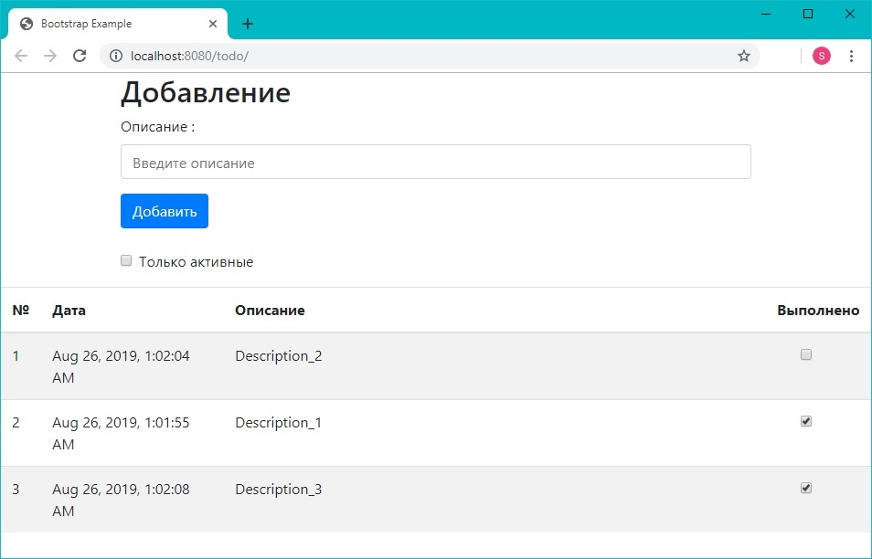
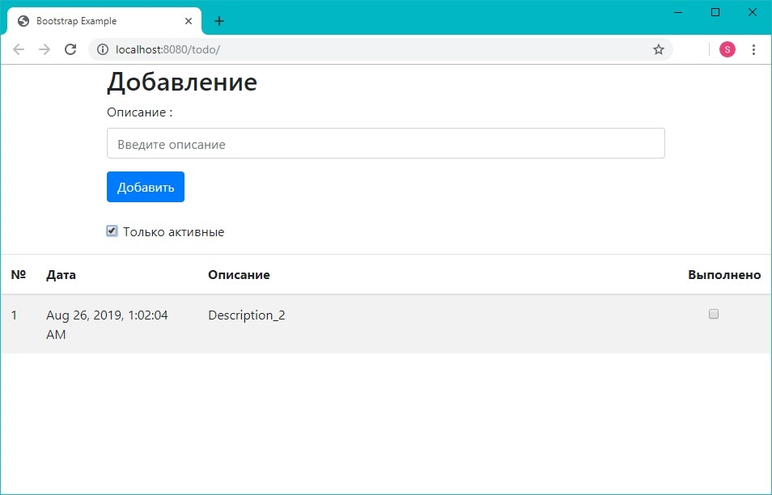

# Приложение "список дел" (PostgreSQL, Hibernate, JavaServlet, ApacheTomcat, JavaScript, Ajax, BootStrap)

Постановка задачи:
Cоздать простое приложение todolist.
 1. веб-приложение должно иметь одну страницу index.html. 
 2. все данные на форму загружаються через ajax.
 3. данные должны сохраняться через hibernate.
<h3>Общий вид</h3>

<h3>Фильтрация активных записей</h3>

